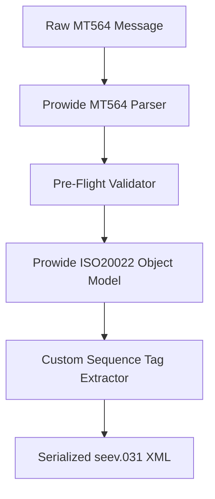

# SWIFT Converter - Technical Implementation Details

This directory contains the Java source code for the SWIFT MT564 to ISO 20022 seev.031 converter.

## 🏗️ Architecture

The converter is designed as a standalone library that processes SWIFT MT564 messages and outputs structured XML that conforms to the `urn:iso:std:iso:20022:tech:xsd:seev.031.001.12` schema.

### 1. `CorpActnNtfctnConverter.java`
The core engine that performs the conversion. It utilizes **Prowide Core** to parse block structures and **Prowide ISO 20022** Java dictionaries to construct the initial XML document.
- **Pre-flight Validation**: Verifies that mandatory blocks (like Block 4) are present, checks for mandatory `CORP` references, `23G` functions, and a baseline security identifier (ISIN).
- **Sequential Block Parsing**: Since some MT564 messages contain nested loops of repeating sequences (e.g., multiple options inside `CAOPTN` blocks), the converter traverses the flat tag stream of Block 4 sequentially using a state-machine parser to capture:
  - Option numbers (`:13A::CAON`)
  - Default flags (`:17B::DFLT`)
  - Date details (Record, payment, market deadlines)
  - Cash movements (`:19B` amounts and currencies)
  - Securities movements (`:36B` quantity and type, `:35B` ISIN)
  - Rate structures (`:92A` gross, net, withholding tax, and price factor rates)
- **Post-processing Replacements**: Inject custom sub-trees and top-level fields (e.g. `PrcgSts`, `ShrhldrRghtsDrctvInd`, `AddtlInf`) by performing precise string replacements on the XML structure generated by the Prowide model.

### 2. `ConversionResult.java`
A container class that wraps the output of a conversion:
- `boolean success`: Indicates if the conversion succeeded without blocking errors.
- `String xml`: The generated ISO 20022 XML string.
- `List<String> errors`: Critical structural or schema errors.
- `List<String> warnings`: SMPG compliance warnings, non-critical field deviations, or advisory notices.

### 3. `MT564MissingFieldException.java`
A custom checked exception thrown when a mandatory field or sequence is missing from the incoming MT564 message (e.g., missing `CORP` or `35B` tags).

### 4. `Main.java`
The CLI entry point. It parses input files, extracts individual message blocks bounded by `{1:` and `-}`, processes them sequentially, and outputs results (warnings, errors, and successfully generated XML) to the standard output and error streams.

### 5. `Reflector.java`
A diagnostic utility that uses Java Reflection to inspect the method and parameter signatures of Prowide classes (such as `CorporateActionGeneralInformation165` and `CorporateActionNotification5`). This helps map field types during development.

---

## 🧪 Testing Strategy

The test suite (`CorpActnNtfctnConverterTest.java`) covers:
1. **Happy Path Tests**: Mapping verification for `DVCA`, `BONU`, `SPLF` events, replacement (`REPL`) documents, and cancellation (`CANC`) notifications.
2. **SMPG Compliance Tests**: Enforces proper warnings for rule violations (e.g. `PROC//ENTL` with non-`NEWM` function or missing `E1`/`E2` sequences).
3. **Field Mapping Accuracy**: Exact checks for ISIN matching, ISO-formatted date structures, and decimal notation handling.
4. **Edge Cases**: Validating messages with minimal mandatory fields, multiple repeating tags, European comma decimal formats, long narratives, and empty/null/malformed inputs.
5. **XSD Validation**: Verifying that the XML is compliant with the schema namespace.
6. **Regression Tests**: A baseline run against standard regression messages.
